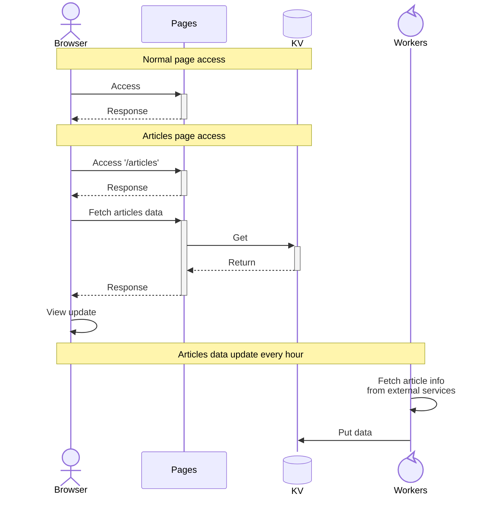

# akuad-web

aKuad's website - Powered by Cloudflare Workers & Pages and KV

<https://akuad.dev>

## How to preview website

```sh
cd pages
npx wrangler pages dev global/
```

Then access to: `http://localhost8788/`

## How to test workers cron script

```sh
cd workers
npx wrangler dev
```

Then access to: `http://localhost:8787/cdn-cgi/handler/scheduled`

## System overview



## License

[CC-BY-4.0](./LICENSE)
